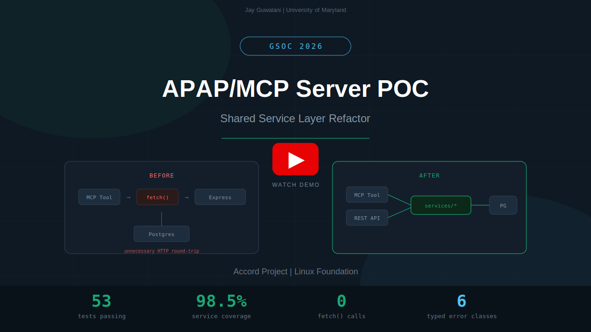

# APAP/MCP Server POC: Shared Service Layer Refactor

**[Accord Project](https://accordproject.org) | Idea #4 -- Hardening the APAP/MCP Server**

This is a working proof-of-concept for the core architectural change proposed in my GSoC application: eliminating the internal HTTP loop in the APAP Reference Implementation's MCP handler by introducing a shared service layer that both MCP tools and REST routes consume directly.

**Author:** Jay Guwalani -- Research Scientist @ University of Maryland, College Park
[GitHub](https://github.com/JayDS22) | jguwalan@umd.edu

**APAP contributions to date:** [Issue #152](https://github.com/accordproject/apap/issues/152), [PR #153](https://github.com/accordproject/apap/pull/153), [PR #154](https://github.com/accordproject/apap/pull/154), [PR #155](https://github.com/accordproject/apap/pull/155), [Issue #143 comment](https://github.com/accordproject/apap/issues/143)

---

## Demo

[](https://www.youtube.com/watch?v=KFwc5IRuKUc)

---

## The Problem

Every MCP tool call in the current RI takes an unnecessary HTTP round-trip through the full Express stack to reach a database sitting in the same process:

```
MCP Tool -> makeApiRequest() -> fetch('http://localhost:9000/...') -> Express -> Handler -> Drizzle -> Postgres
```

The `makeApiRequest()` helper in `handlers/mcp.ts` is effectively calling itself over the network. On top of that, error handling is all bare strings (`throw new Error('Failed to load template')`) with no distinction between a 404, a 400, or a 500.

I ran into the same architecture at Bridgestone where five specialized agents were routing through an internal REST gateway to reach a shared Postgres instance. The fix was identical: pull the business logic into a shared service layer and let each transport call it directly.

## The Fix

```
MCP Tool ----\
              >-- services/agreementService.ts --> Drizzle --> Postgres
REST API ----/
```

One function. Two consumers. No HTTP loop. Bug fixes propagate to both protocols automatically.

## Project Structure

```
src/
  config.ts                 Zod-validated env vars, fail-fast on startup
  index.ts                  Server entry, wires Express + MCP transports + health check

  db/
    schema.ts               Drizzle schema (mirrors APAP RI exactly)
    client.ts               Connection pool factory with DI for tests

  services/
    errors.ts               Typed error hierarchy (6 classes replacing bare strings)
    templateService.ts      Template CRUD via Drizzle
    agreementService.ts     Agreement CRUD + convert + trigger
    index.ts                Barrel export

  handlers/
    mcp.ts                  MCP tool/resource registration (SSE + StreamableHTTP)

  routes/
    api.ts                  REST router, same service imports as MCP

  middleware/
    logging.ts              Pino structured logging, request-id correlation
    healthz.ts              /healthz for Docker readiness probes
```

**Invariants that make this work:**
- Every service function takes `db` as its first parameter (testable without Postgres)
- Services return typed results, never raw HTTP responses
- Services throw `ServiceError` subclasses, never bare strings
- Services import nothing from Express or the MCP SDK

## Quick Start

**Docker (30 seconds):**

```bash
git clone https://github.com/JayDS22/apap-mcp-poc.git
cd apap-mcp-poc
docker compose up
```

**Local (requires Postgres running):**

```bash
cp .env_example .env        # edit credentials if needed
npm install
npx drizzle-kit push
npm run dev
```

Either way, you get:

```
APAP MCP POC server listening on http://0.0.0.0:9000
  REST API:       http://0.0.0.0:9000/capabilities
  MCP SSE:        http://0.0.0.0:9000/sse
  MCP Streamable: POST http://0.0.0.0:9000/mcp
  Health:         http://0.0.0.0:9000/healthz
```

## End-to-End Walkthrough

Once the server is running, walk through the full lifecycle:

```bash
# Health check
curl http://localhost:9000/healthz
# {"status":"ok","timestamp":"2026-03-28T..."}

# Capabilities (matches APAP RI format)
curl http://localhost:9000/capabilities
# ["TEMPLATE_MANAGE","AGREEMENT_MANAGE","SHARED_MODEL_MANAGE","AGREEMENT_CONVERT_HTML"]

# Create a template
curl -s -X POST http://localhost:9000/templates \
  -H 'Content-Type: application/json' \
  -d '{
    "uri": "resource:org.accordproject.protocol@1.0.0.Template#latedelivery",
    "author": "dan",
    "displayName": "Late Delivery and Penalty",
    "version": "1.0.0",
    "description": "Penalties for late delivery of goods",
    "license": "Apache-2.0",
    "keywords": ["late", "delivery", "penalty"],
    "metadata": {"$class": "org.accordproject.protocol@1.0.0.TemplateMetadata", "runtime": "typescript", "template": "clause", "cicero": "0.25.x"},
    "templateModel": {"$class": "org.accordproject.protocol@1.0.0.TemplateModel", "typeName": "LatePenaltyClause", "model": {"ctoFiles": []}},
    "text": {"templateMark": "Late Delivery and Penalty clause text..."}
  }'

# Create an agreement referencing the template
curl -s -X POST http://localhost:9000/agreements \
  -H 'Content-Type: application/json' \
  -d '{
    "uri": "apap://agreement-demo1",
    "data": {"$class": "io.clause.latedeliveryandpenalty@0.1.0.TemplateModel", "forceMajeure": false, "penaltyPercentage": 10.5, "capPercentage": 55, "clauseId": "demo-1"},
    "template": "resource:org.accordproject.protocol@1.0.0.Template#latedelivery",
    "agreementStatus": "DRAFT"
  }'

# Convert to markdown
curl http://localhost:9000/agreements/1/convert/markdown

# Convert to HTML (open in browser)
curl http://localhost:9000/agreements/1/convert/html -o /tmp/agreement.html && open /tmp/agreement.html

# Trigger agreement logic
curl -s -X POST http://localhost:9000/agreements/1/trigger \
  -H 'Content-Type: application/json' \
  -d '{"$class":"io.clause.latedeliveryandpenalty@0.1.0.LateDeliveryAndPenaltyRequest","forceMajeure":false,"goodsValue":1000}'

# Structured error handling -- typed error, not a bare string
curl http://localhost:9000/agreements/9999
# {"error":{"code":"AGREEMENT_NOT_FOUND","message":"Agreement not found: 9999","details":{"identifier":9999}}}
```

### MCP Inspector

```bash
npx @modelcontextprotocol/inspector
# Open http://127.0.0.1:6274
# Select SSE transport, URL: http://localhost:9000/sse
# Browse Resources, call Tools (getAgreement, convert-agreement-to-format, trigger-agreement)
```

## Tests

```bash
npm test                  # 53 tests + coverage
npm run test:unit         # 44 unit tests (mocked DB, no Postgres)
npm run test:integration  # 9 integration tests (real Express, mock DB)
npm run typecheck         # TypeScript strict mode
```

Service layer coverage: **98.69% statements / 92.3% branches / 100% functions**. `errors.ts` and `templateService.ts` are at 100% across the board.

## Error Handling

The RI throws `new Error('Failed to load template')` on every failure path. This POC replaces those with typed errors carrying machine-readable codes, HTTP status mappings, and structured details:

| Error Class | HTTP | Code | When |
|---|---|---|---|
| `TemplateNotFoundError` | 404 | `TEMPLATE_NOT_FOUND` | Template ID/URI not found |
| `AgreementNotFoundError` | 404 | `AGREEMENT_NOT_FOUND` | Agreement ID not found |
| `AgreementConversionError` | 500 | `AGREEMENT_CONVERSION_FAILED` | Rendering fails |
| `InvalidPayloadError` | 400 | `INVALID_PAYLOAD` | Trigger payload not valid JSON |
| `TemplateDuplicateError` | 409 | `TEMPLATE_DUPLICATE` | URI uniqueness violation |
| `ValidationError` | 422 | `VALIDATION_ERROR` | Schema validation failure |

The MCP handler and REST router each have their own catch block that maps `ServiceError` into the right response shape for their protocol. Anything that is not a `ServiceError` is treated as a genuine 500.

## GSoC Timeline Mapping

| Weeks | Phase | What This POC Covers |
|---|---|---|
| 1-4 | Service Layer + Error Types | `src/services/` -- full CRUD, convert, trigger, 6 error classes |
| 5-8 | Testing Infrastructure | `__tests__/` -- unit + integration across both MCP transports |
| 9-10 | CI/CD | `.github/workflows/ci.yml` + Docker Compose |
| 11-12 | Observability + Docs | Pino logging, health checks, this README |

Phases 3-4 of the proposal (OpenAPI validation, load testing, contributor docs) build directly on top of this foundation.

## Prior Art

I have shipped this exact shared-service-layer pattern twice in production:

**Bridgestone (2022-2024):** Five specialized agents (analytics, trip data, driver safety, fleet performance, crash analysis) routing through an internal REST gateway to Postgres. Refactored to shared services, cut P95 latency by 40%, and brought the system under test coverage for the first time in its lifecycle.

**Aya Healthcare (2025):** LangGraph multi-agent pipeline with 5+ agents (screening, skill assessment, matching, scheduling, FAQ) sharing a Postgres backend through typed service functions over OCI/AWS. Same pattern, same DI approach for testability.

## Links

- [APAP Repository](https://github.com/accordproject/apap) -- upstream codebase this POC refactors
- [Accord Project](https://accordproject.org)
- [GSoC 2026 Ideas](https://wiki.hyperledger.org/display/INTERN/Accord+Project+GSoC+2026+Ideas) -- Idea #4
- [MCP Protocol Specification](https://modelcontextprotocol.io)

## License

Apache-2.0
