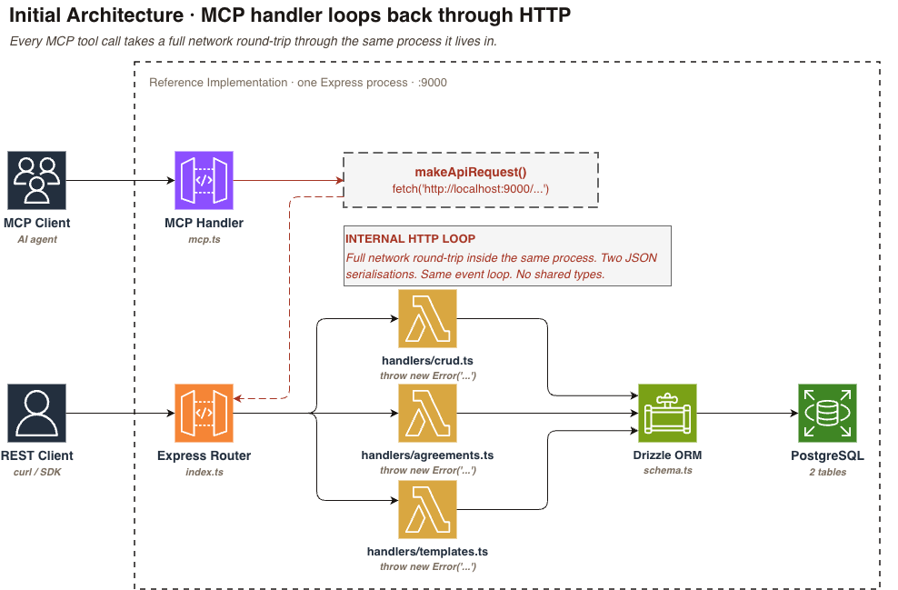
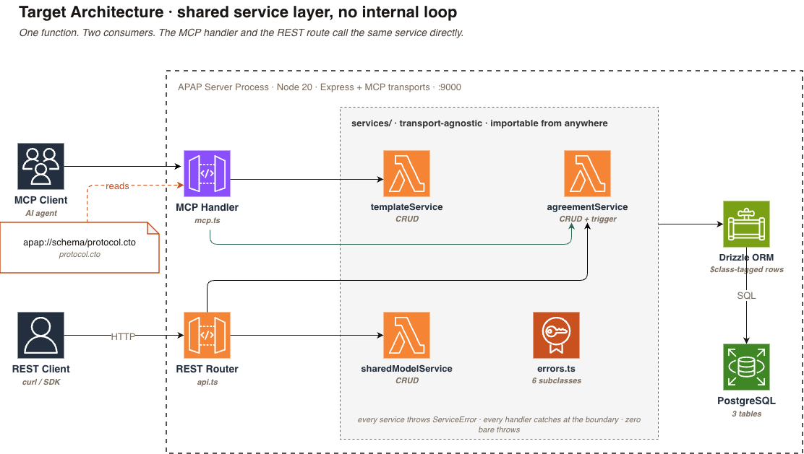
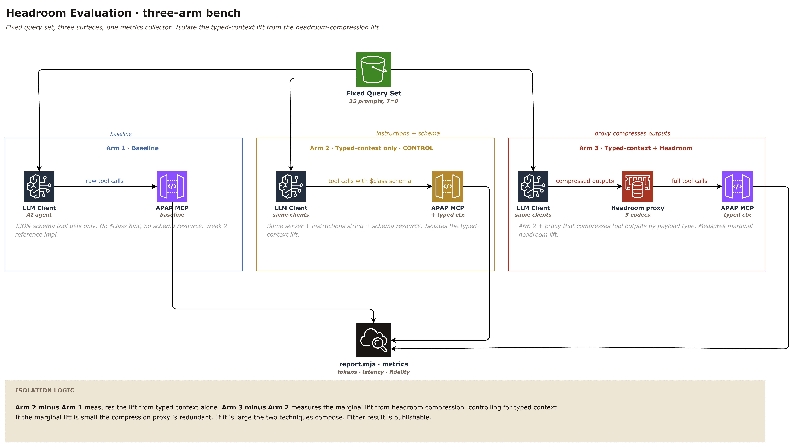
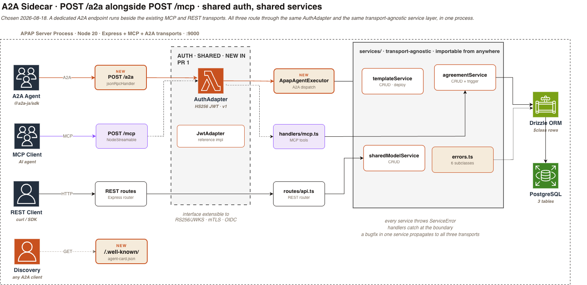
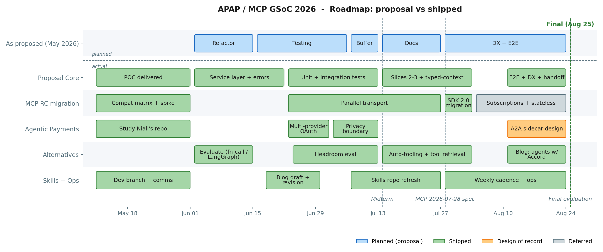
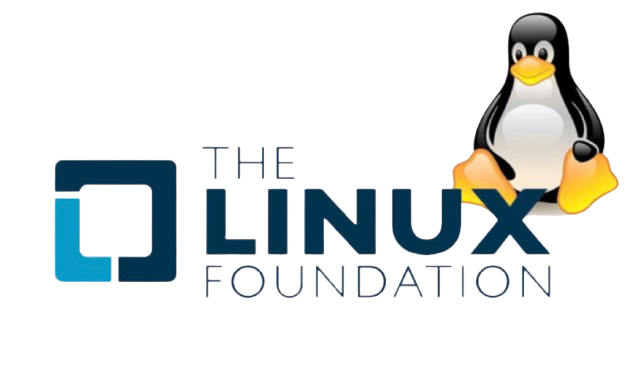

<p>
  
  
</p>
<br clear="all"><br clear="all">

# Rewiring APAP for Agents: MCP, A2A, and a Shared Service Layer

*The end-to-end walkthrough: what the seam between an LLM agent and a contract protocol has to look like when agents are the primary caller. Twelve weeks, six workstreams, 28 upstream merges on `accordproject/apap`.*

> **TL;DR.** <strong style="color: #1565c0;">28 PRs</strong> into `accordproject/apap` <strong style="color: #2e7d32;">removed the MCP handler's internal HTTP loop</strong>, <strong style="color: #2e7d32;">unified REST + MCP under a shared service layer with typed errors</strong>, <strong style="color: #2e7d32;">migrated the RI to MCP SDK 2.0 in a single reviewable PR</strong>, and ratified a sidecar architecture for A2A as <strong style="color: #ef6c00;">design-of-record</strong>. Typed context lifts frontier-model agent performance by <strong style="color: #2e7d32;">+20pp on Claude Sonnet 4.6</strong> and <strong style="color: #2e7d32;">+38pp on GPT-4o</strong> in a first-pass three-arm A/B (rerun pending).

---

## Contents

- `01`: The seam is load-bearing
- `02`: The MCP surface was calling itself over HTTP
- `03`: Errors that agents can act on
- `04`: One source of truth, no localhost round-trip
- `05`: Three surfaces, same six operations
- `06`: MCP SDK 2.0, no flag day
- `07`: A2A: a design, not a build
- `08`: Proposed vs shipped
- `09`: Two things did not ship, on purpose
- `10`: Run it locally in about a minute

*10 sections · ~10 min read*

---

## `01`: The seam is load-bearing

The pre-GSoC MCP handler for `templates.list` was a thin wrapper. Most of it marshaled HTTP request and response envelopes for a call to another route on the same server. It read as a client library. It was the server calling itself.

That is a small technical defect and a large narrative one. The agentic economy is not a projection. AI agents are already transacting on-chain in fractions of a cent via protocols like x402, running MCP tools inside Claude Code and ChatGPT desktop, and delegating tasks agent-to-agent through the emerging A2A wire spec. The protocols they call were built for humans who can triage a vague `500`. Agents cannot. If an agent cannot tell "the record is missing" from "the database is on fire", it has no basis to retry, fall back, or escalate.

Accord Project's Agreement Protocol (APAP) sits at the contract layer of that stack: the lifecycle spec for template registration, agreement instantiation, event triggering, state, and governance, modelled in Concerto (the Accord Project's typed knowledge-representation language for business data). Concerto generates the OpenAPI surface, the Drizzle schema, and the `$class` discriminators that let an agent recognize a `Template` from a `Trigger` from an `Agreement`.

The Reference Implementation ships an Express + Postgres server speaking REST and MCP on top of that model. Idea #4 in the 2026 GSoC ideas list was to harden it for the agent era.

What shipped over twelve weeks:

- **28 merged PRs** on `accordproject/apap` between June 2 and August 25
- **MCP SDK 2.0** migration completed on the RI ([#227](https://github.com/accordproject/apap/pull/227))
- **PG18** support with an RLS-isolation smoke test in CI ([#245](https://github.com/accordproject/apap/pull/245))
- **Paged MCP resource URIs** via RFC 6570 form-style query expansion ([#243](https://github.com/accordproject/apap/pull/243))
- **A2A wrapper**: sidecar architecture ratified 2026-08-18, spec published at [#247](https://github.com/accordproject/apap/issues/247)

---

## `02`: The MCP surface was calling itself over HTTP

Two transports live on the same Express process: REST for humans and CI, MCP for agents. The pre-GSoC MCP path had a structural problem: the MCP tool handlers called back into the REST app over HTTP.

```typescript
// pre-GSoC: handlers/mcp.ts
const response = await makeApiRequest('http://localhost:9000/templates');
```

Same process, same request lifetime, but every MCP call paid a serialization tax, went through the routing middleware twice, and had business logic duplicated between the handler and the route it was calling.

<figure style="margin: 1.5em 0;">
  
  <figcaption style="font-size: 0.9em; color: #555555; margin-top: 0.5em; text-align: center;">
    <em>Figure 1. Initial architecture. Every MCP tool call is a full HTTP round-trip inside the same Express process: <code>mcp.ts</code> calls <code>makeApiRequest()</code> which fetches <code>localhost:9000/...</code>, hits the router, then runs the handler that was going to run anyway. Two JSON serialisations. Same event loop. No shared types.</em>
  </figcaption>
</figure>

The proposal called out three concrete gaps at submission time:

- The internal HTTP loop in the MCP handlers
- Zero automated tests on the MCP layer
- Missing client documentation for common agent runtimes

This post follows those threads.

---

## `03`: Errors that agents can act on

The pre-GSoC RI threw bare `Error("template not found")` strings from handlers. Express mapped everything to `500`. An agent could not distinguish a missing record, a validation failure, a duplicate primary key, or a database outage.

The fix: a typed `ServiceError` hierarchy in the shared service layer. Each subclass carries:

- A machine-readable code (`NOT_FOUND`, `VALIDATION_FAILED`, `CONFLICT`)
- An appropriate HTTP status (`404`, `422`, `409`)
- A structured `details` payload the caller can branch on

```typescript
// BEFORE
throw new Error(`Template ${id} not found`);
// -> HTTP 500, opaque body, agent has to string-match

// AFTER
throw new NotFoundError('template', id);
// -> HTTP 404, { code: 'NOT_FOUND', entity: 'template', id }, agent branches
```

The MCP handler and the REST router each own a small catch block that maps `ServiceError` to a protocol-appropriate response. Anything that is *not* a `ServiceError` is a real 500 and pages someone.

For a contract protocol, this is not only a developer-ergonomics win. Typed errors are audit-trail primitives. `TEMPLATE_NOT_FOUND` on an agreement instantiation, `AGREEMENT_CONVERSION_FAILED` on a state transition, and `VALIDATION_FAILED` on a Concerto-typed payload are distinguishable events in a log a dispute-resolution process can read. Opaque 500s are not.

---

## `04`: One source of truth, no localhost round-trip

The service-layer refactor is the biggest change of the cycle. Business logic moved into `src/services/`, keyed on the DB rather than on Express.

The rules the refactor enforces:

- Every service takes `db` as its first parameter
- Every service returns typed results and throws `ServiceError` subclasses
- No service file imports from Express or from the MCP SDK
- Both transports call the same functions; a bug fix in a service propagates to both protocols in a single commit

A service function in its post-refactor form:

```typescript
// src/services/templateService.ts
export async function getTemplateById(
  db: Database,
  id: number,
): Promise<TemplateRow> {
  const rows = await db.select().from(Template).where(eq(Template.id, id)).limit(1);
  if (rows.length === 0) throw new TemplateNotFoundError(id);
  return rows[0];
}
```

The MCP tool handler and the REST route both call `getTemplateById(db, id)` directly. Neither speaks HTTP to the other. `TemplateNotFoundError` is a `ServiceError` subclass that carries the code `TEMPLATE_NOT_FOUND`, HTTP status `404`, and a structured `identifier` field in its details. The REST router catches it and returns `404 { error: { code, message, details } }`. The MCP handler catches the same class and emits a JSON-RPC error carrying the same code and structured details. One throw, two protocol-appropriate responses.

Successful responses carry the same shared context. Every row round-trips its Concerto `$class` discriminator intact, and MCP resource URIs (`apap://templates/{id}`, `apap://agreements/{id}`) give an agent a stable citation back to the source object. Grounding an answer back to the template it came from is a URI lookup, not a full-text search.

Landed as five upstream slices across the middle of the cycle. Each slice ported one entity family (templates, agreements, sharedModels, capabilities, health). The final slice removed the last `makeApiRequest` callsite. An `import express from 'express'` in a service file gets caught in review; the refactor is defeated the moment a transport dependency leaks in.

<figure style="margin: 1.5em 0;">
  
  <figcaption style="font-size: 0.9em; color: #555555; margin-top: 0.5em; text-align: center;">
    <em>Figure 2. Target architecture. Both transports call the same functions. <code>ServiceError</code> is the only thing they interpret differently.</em>
  </figcaption>
</figure>

The safety net that keeps the boundary honest: 53 tests in the POC (44 unit, 9 integration) hit `98.55%` statement, `92.3%` branch, and `100%` function coverage against `src/services/`. Coverage thresholds fail the `vitest` run on regression. Upstream `apap/server` carries 10 jest suites (200 assertions) covering REST handlers, MCP handlers, and the service layer end-to-end.

Once the layer existed, the surfaces stacked on top of it stopped needing to know about each other.

---

## `05`: Three surfaces, same six operations

APAP targets three surfaces for the same six template + agreement operations (templates: list, get, upload, deploy; agreements: instantiate, trigger + convert). REST and MCP are live; A2A is design-done with implementation deferred. Different protocols, same domain, outputs equivalent across all three:

| Surface | Discovery | Auth model (v1) | Best fit |
|:---|:---|:---|:---|
| **REST** | OpenAPI at `/openapi.json` | Session / API key | Humans, CI, existing integrations |
| **MCP** | `initialize` handshake | None (auth surface is on A2A) | Any MCP-native client |
| **A2A** *(design)* | `/.well-known/agent-card.json` | HS256 shared-secret JWT | Agent-to-agent orchestration |

A `templates.list` request over REST (`GET /templates`), over MCP (`tools/call` on `templates.list`), or over A2A once the endpoint ships (`POST /a2a` with `skill.templates.list`) each traces back to the same `listTemplates(db)` call. The response envelope differs; the row set does not.

So does any of this actually help the model, or is it only easier on the server author? A typed-context A/B evaluation ran alongside the refactor to answer that. The harness is a three-arm bench.

<figure style="margin: 1.5em 0;">
  
  <figcaption style="font-size: 0.9em; color: #555555; margin-top: 0.5em; text-align: center;">
    <em>Figure 3. Three-arm headroom bench. Arm 1 baseline: JSON schema only, <code>$class</code> stripped, no schema instructions. Arm 2 typed-context: same server and prompts, <code>InitializeResult.instructions</code> populated with the Concerto schema. Arm 3 typed-context + headroom compression proxy: measures the marginal headroom lift.</em>
  </figcaption>
</figure>

Arm 2 minus Arm 1 isolates the lift from typed context alone. Arm 3 minus Arm 2 isolates the marginal lift from headroom compression, controlling for typed context. First-pass results on the shared task set:

| Model | Arm 1 (baseline) | Arm 2 (typed context) | Lift |
|:---|---:|---:|---:|
| Claude Sonnet 4.6 | baseline | **+20pp** | typed context alone |
| GPT-4o | baseline | **+38pp** | typed context alone |

Two different frontier models, same server, same prompts, same evaluation rubric. Both moved in the same direction. Both moved by more than the noise floor of the first-pass run. A statistically defensible rerun with confidence intervals and pre-registered arms is in progress; the honest reading of first-pass numbers is that typed context helps and helps more for the model with the weaker prior over the domain. Harness and rerun methodology live at [`JayDS22/apap-mcp-poc#3`](https://github.com/JayDS22/apap-mcp-poc/pull/3); [#199](https://github.com/accordproject/apap/pull/199) tracks the upstream version.

The takeaway is unchanged and load-bearing for the rest of the cycle: typed errors and typed context are not cosmetic. They move the needle on downstream agent behaviour, and the size of the effect is model-dependent.

---

## `06`: MCP SDK 2.0, no flag day

The MCP SDK cut its 2.0 line during this cycle. It is a split-package rewrite, not a semver bump. Packages moved to `@modelcontextprotocol/{core,server,express,node,client}`. SSE was dropped in favour of `NodeStreamableHTTPServerTransport`. `McpError` became a `ProtocolError` hierarchy. Tool registration moved from `.tool()` to `.registerTool()`.

Migration landed as [#227](https://github.com/accordproject/apap/pull/227): the full package swap, tool-registration port, and SSE-to-`NodeStreamableHTTPServerTransport` transition in one atomic diff. One PR, one review, one rollback point. Tests stayed green throughout.

The diff was clean; the merge was not. #227 shipped with a stray `undefined@0.1.0` in `server/package.json` (a junk package from a bad `npm install`) and a coverage-config regression that Niall caught after merge. [#231](https://github.com/accordproject/apap/pull/231) was the follow-up that fixed both, and [#245](https://github.com/accordproject/apap/pull/245) later restored the same dep pins after a rebase silently dropped them. The right time to catch these is before merge. The second-right time is a cleanup PR the same week.

<blockquote style="border-left: 4px solid #2e7d32; padding: 0.6em 1.2em; margin: 1.5em 0; font-size: 1.2em; font-style: italic; color: #1a1a1a; background: #f5faf5;">
"The diff was clean; the merge was not."
</blockquote>

For integrators: any MCP client on the pre-2.0 line needs to update its import paths (`@modelcontextprotocol/sdk` -> `@modelcontextprotocol/{core,server,express,node,client}`), swap `.tool()` for `.registerTool()`, and replace `McpError` handling with the new `ProtocolError` hierarchy. SSE clients need to move to Streamable HTTP.

Paged resource URIs followed in [#243](https://github.com/accordproject/apap/pull/243) using RFC 6570 form-style expansion (`apap://templates{?limit,offset}` and `apap://agreements{?limit,offset}`). Bare URIs stay registered statically for backwards compatibility, defaulting to page 1. Stable `orderBy(asc(id))` on the un-paged variants prevents row repetition between pages.

Alongside the SDK migration:

- **SEP-2549 cache hints** shipped via [#201](https://github.com/accordproject/apap/pull/201)
- **PG18** support landed via [#245](https://github.com/accordproject/apap/pull/245), with a smoke test in `build.yml` that walks a `set_config('app.user_id', ...)` cycle against a `ROW LEVEL SECURITY` policy so a non-superuser role cannot bypass the tenant boundary
- **Exact-pin** on `@modelcontextprotocol/*@2.0.0` matches APAP's existing convention

---

## `07`: A2A: a design, not a build

A2A was scoped to a design-of-record deliverable for this GSoC cycle, not an implementation slice. By week 11 it was clear why: the failure modes worth caring about live in the design (auth boundary, discovery semantics, transport composition), not the code. Week 12 went to the design; sidecar was ratified 2026-08-18 by Dan and Niall. Implementation is a follow-on workstream against [#247](https://github.com/accordproject/apap/issues/247), separate from the GSoC deliverable.

The first pass of #247 came back with a reviewer note that it "reads AI-generated." Accurate. A design proposal that lists three alternatives with even-handed pros and cons is easier to write than a design proposal that picks one and defends the pick. The rewrite that landed picks sidecar, states the reason, and treats R1 and R2 as "here is why not" rather than "here is another option." That register change carried through every design document after it.

<figure style="margin: 1.5em 0;">
  
  <figcaption style="font-size: 0.9em; color: #555555; margin-top: 0.5em; text-align: center;">
    <em>Figure 4. A2A sidecar architecture. <code>POST /a2a</code> runs alongside <code>POST /mcp</code> on the same Express process. <code>/a2a</code> is auth-gated via the shared <code>AuthAdapter</code>; <code>/mcp</code> and REST stay open by design. All three handlers call the same transport-agnostic service layer. Discovery lives at <code>/.well-known/agent-card.json</code>.</em>
  </figcaption>
</figure>

The chosen shape:

- A dedicated `POST /a2a` endpoint mounted on the same Express app via `jsonRpcHandler` from `@a2a-js/sdk/server/express`
- A shared `AuthAdapter` utility on the `/a2a` route; `/mcp` and REST stay unauthed by design (scoping call ratified with mentors in week 12)
- The same service layer under both `ApapAgentExecutor` and the existing MCP handler
- Discovery served at `/.well-known/agent-card.json`

Two true-adapter readings were evaluated and rejected, and the reasoning generalizes to any team weighing "add a protocol" against "multiplex on an existing one":

- **R1 registered A2A skills as MCP tools inside the existing MCP transport.** Zero new routes, zero new dependencies, one obvious flaw: no `POST /a2a` exists, so nothing hitting the A2A wire spec (agent cards, JSON-RPC method names, discovery semantics) can succeed. Compliance failure is categorical, not incremental.
- **R2 multiplexed A2A and MCP methods on `/mcp` via a custom JSON-RPC dispatch middleware.** Neither SDK ships that glue. A single dispatcher failure would take down both protocols at once. Protocol coupling that neither vendor supports is a bet that both vendors will keep their JSON-RPC surfaces compatible forever; the correct default is to assume they will not.

Sidecar keeps the surfaces independent at the routing layer, at the SDK layer, and at the failure-isolation layer, while still sharing the one thing that matters (the service layer beneath). Full analysis at [#247](https://github.com/accordproject/apap/issues/247).

Auth for v1 is HS256 shared-secret JWT via a bundled `JwtAdapter` reference. The `AuthAdapter` interface stays extensible so future adapters can add RS256 with JWKS, mTLS, or OIDC without breaking existing consumers.

Auth is table stakes. The harder work sits above the adapter: retention policy, jurisdictional data residency, PII on agreement payloads. `AuthAdapter` keeps its scope narrow on purpose so integrators can slot that middleware in above `extractUser` without touching the transport.

<blockquote style="border-left: 4px solid #ef6c00; padding: 0.6em 1.2em; margin: 1.5em 0; font-size: 1.2em; font-style: italic; color: #1a1a1a; background: #fff8f0;">
"Auth is table stakes. The harder work sits above the adapter."
</blockquote>

---

## `08`: Proposed vs shipped

<figure style="margin: 1.5em 0;">
  
  <figcaption style="font-size: 0.9em; color: #555555; margin-top: 0.5em; text-align: center;">
    <em>Figure 5. Roadmap: proposal vs shipped. Top lane (blue) shows the five phases scoped in the May 2026 proposal. Bottom lanes show what actually ran: green pills shipped as code, amber is design of record only (A2A sidecar), grey is deferred to a post-GSoC follow-up (subscriptions + stateless).</em>
  </figcaption>
</figure>

The proposal scoped four deliverables against the RI as it existed on June 2: a shared service layer with structured errors, four-tier testing at 90%+ CI coverage, client-specific tutorials, and Docker Compose + Pino + `/healthz`. By August 25, the shape of the cycle had absorbed five additional workstreams that weren't in the original scope. The MCP SDK cut its 2.0 line mid-cycle, the Concerto ecosystem bumped through PG18 and cicero-core 2.x, the A2A wire spec matured enough to warrant a design of record, and the typed-context A/B eval emerged as the "does this actually help the model?" question. The plan absorbed the moving parts.

| Workstream | In proposal? | Final state |
|:---|:---|:---|
| Service layer + typed errors | Yes | <strong style="color: #2e7d32;">Done</strong> |
| Four-tier testing + 90%+ CI coverage | Yes | <strong style="color: #2e7d32;">Done</strong> (E2E tier thinner than proposed, folded into integration) |
| Client tutorials (Claude / ChatGPT / MCP Inspector) | Yes | <strong style="color: #ef6c00;">Partial</strong>, folded into `docs/` + hosted sample |
| Docker Compose + Pino + `/healthz` | Yes | <strong style="color: #2e7d32;">Done</strong> |
| MCP SDK 2.0 migration ([#227](https://github.com/accordproject/apap/pull/227)) | No | <strong style="color: #2e7d32;">Done</strong> |
| PG18 support + RLS smoke ([#229](https://github.com/accordproject/apap/pull/229), [#245](https://github.com/accordproject/apap/pull/245)) | No | <strong style="color: #2e7d32;">Done</strong> |
| Paged MCP resource URIs ([#243](https://github.com/accordproject/apap/pull/243)) | No | <strong style="color: #2e7d32;">Done</strong> |
| Typed-context A/B eval ([#199](https://github.com/accordproject/apap/pull/199)) | No | <strong style="color: #2e7d32;">Done</strong> |
| A2A wrapper (sidecar design) | No | <strong style="color: #ef6c00;">Design done</strong>, impl deferred |
| Subscriptions + stateless (SDK 2.0 native) | No | <strong style="color: #546e7a;">Deferred</strong> to [#232](https://github.com/accordproject/apap/issues/232) |

Five workstreams shipped as code, one shipped as design of record, one deferred to a follow-up branch. The honest gap is the E2E test tier, which stayed thinner than proposed and folded into integration coverage rather than a dedicated harness. Rationale for A2A design-only is in §07.

---

## `09`: Two things did not ship, on purpose

**A2A implementation** (route + shared `AuthAdapter` + reference JWT adapter + `ApapAgentExecutor` + discovery card + tests + `docs/auth.md`) was out of scope for the GSoC window by design. Design of record and one open decision (`AUTH_ADAPTER=none` in production: throw or warn) sit at [#247](https://github.com/accordproject/apap/issues/247) as the seed for a follow-on workstream.

**Subscriptions and listen** on the SDK 2.0 native transport is implemented on a follow-up branch and continues post-GSoC. Tracking issue [#232](https://github.com/accordproject/apap/issues/232).

### What continues post-GSoC

Concrete tickets, each claimable in one click:

- **A2A PR 1 implementation** (route + shared `AuthAdapter` + `JwtAdapter` reference + `ApapAgentExecutor` + discovery card + tests + `docs/auth.md`): [#247](https://github.com/accordproject/apap/issues/247), unblocks once the `AUTH_ADAPTER=none` decision lands
- **Subscriptions and `listen`** on the SDK 2.0 native `NodeStreamableHTTPServerTransport`: [#232](https://github.com/accordproject/apap/issues/232), follow-up branch already carries the plumbing
- **Typed-context A/B rerun** with pre-registered arms and confidence intervals: [`JayDS22/apap-mcp-poc#3`](https://github.com/JayDS22/apap-mcp-poc/pull/3), upstream [#199](https://github.com/accordproject/apap/pull/199)
- **Paged MCP resource completeness signal** (`hasMore`, `_meta.nextUri`, or both): [#244](https://github.com/accordproject/apap/issues/244)
- **Resource notification fan-out semantics** on unpaged variants: [#239](https://github.com/accordproject/apap/issues/239)
- **RS256 + JWKS `AuthAdapter`** reference implementation, extending the interface shipped in A2A PR 1

Three open questions for anyone building the next MCP or A2A server:

- **How should an MCP tool contract version when the protocol schema changes?** Concerto lets APAP evolve; MCP tool definitions are pinned by client-side caching once an agent has done `initialize`. No established pattern yet. Seeded at [#244](https://github.com/accordproject/apap/issues/244) and [#239](https://github.com/accordproject/apap/issues/239).
- **What is the right auth model for a public agent endpoint on a contract protocol?** HS256 for v1 A2A is a scoping call, not a recommendation. Whoever writes the first RS256-with-JWKS `AuthAdapter` against APAP shapes the pattern the ecosystem picks up.
- **MCP tool or A2A skill?** For any capability an owner exposes on both surfaces, the question is unresolved. Tentative rule: MCP tools for the agent's own reasoning loop, A2A skills for delegated tasks. Breaks the moment the same capability is both.

---

## `10`: Run it locally in about a minute

The POC boots a full APAP + Postgres stack in one command:

```bash
git clone https://github.com/JayDS22/apap-mcp-poc
cd apap-mcp-poc
docker compose up            # Postgres + server, ~30 seconds
```

Once the server logs `listening on 0.0.0.0:9000`, hit the three surfaces:

```bash
# Health
curl -s http://localhost:9000/healthz

# REST
curl -s http://localhost:9000/templates | jq

# MCP capabilities handshake
curl -s http://localhost:9000/capabilities | jq

# MCP tools (via the modelcontextprotocol inspector)
npx @modelcontextprotocol/inspector \
  --transport streamable-http --url http://localhost:9000/mcp
```

The Reference Implementation upstream runs the same way from `accordproject/apap/server`:

```bash
git clone https://github.com/accordproject/apap
cd apap/server
docker compose up
```

A hosted sample lives on Railway; the one-click Deploy button in the repo README stands it up in a fresh Railway workspace in under a minute, no local Docker required.

### An end-to-end example

One agent call, in the shape it actually goes over the wire:

```jsonc
// tools/call
{
  "jsonrpc": "2.0", "id": 1,
  "method": "tools/call",
  "params": { "name": "templates.list", "arguments": { "limit": 10 } }
}

// -> success: resource_link back to the source, agent has a citation
{
  "jsonrpc": "2.0", "id": 1,
  "result": {
    "content": [{
      "type": "resource_link",
      "uri": "apap://templates/42",
      "name": "mutual-nda@1.3.0",
      "mimeType": "application/vnd.accord-template+json"
    }]
  }
}
```

Chained end-to-end this becomes: natural language input, `templates.list` narrows to a candidate, `templates.get` pulls the Concerto schema, the agent instantiates fields against that schema, `agreements.create` persists and returns an `apap://agreements/{id}` URI for the audit trail. Steven Obiajulu's [OpenAgreements](https://github.com/openagreements) is one real integration built on exactly this shape: natural language, Concerto validation, filled Bonterms Mutual NDA, DocuSign envelope, all inside a single Claude Code conversation.

---

## Thanks

Twelve weeks of review and architectural sparring from Niall Roche and Dan Selman shaped every decision in this post. Niall's push to keep A2A spec-first through weeks 11 and 12 is the reason there is a design worth reviewing rather than a half-built adapter to throw away. Dan's line that the sidecar shape "needed a personal opinion, not a menu" reset [#247](https://github.com/accordproject/apap/issues/247) from an alternatives catalog into a design of record. Sanket Shevkar's verifiable-agreements context shaped the A2A auth boundary.

The work landed alongside active parallel contributions from the broader Accord Project community during the same window: Matt Roberts on the Railway deploy path, LCP discovery, template archive uploads, and the cicero-core 2.x / concerto-core 4.x upgrade chain; Steven Obiajulu on the MCP agreement-creation tool that seeded the workflow example above; Sonia Duma on the Concerto Playground; Rockaxorb13 on external shared-model retrieval and the obligations model.

---

**Links**

- Upstream repository: [`accordproject/apap`](https://github.com/accordproject/apap)
- POC that seeded this work: [`JayDS22/apap-mcp-poc`](https://github.com/JayDS22/apap-mcp-poc)
- Design of record for the A2A wrapper: [issue #247](https://github.com/accordproject/apap/issues/247)

---

<div style="text-align: center; margin: 2.5em 0 1em 0;">
  
  <p style="color: #555555; font-size: 0.85em; letter-spacing: 0.05em; margin: 0;">
    <strong>ACCORD PROJECT</strong> IS AN OPEN GOVERNANCE PROJECT HOSTED BY <strong>THE LINUX FOUNDATION</strong>
  </p>
  <p style="color: #888888; font-size: 0.8em; margin: 0.4em 0 0 0;">
    <a href="https://accordproject.org" style="color: #888888; text-decoration: none;">accordproject.org</a>
    &nbsp;·&nbsp;
    <a href="https://linuxfoundation.org" style="color: #888888; text-decoration: none;">linuxfoundation.org</a>
  </p>
</div>
