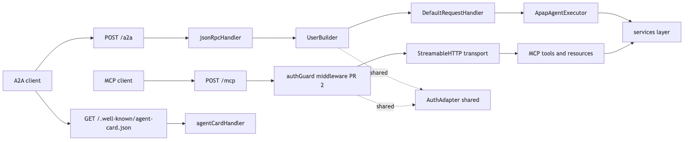
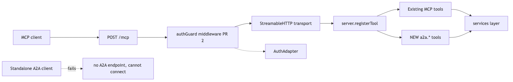
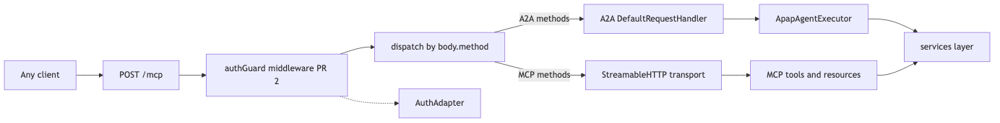

# A2A wrapper for accordproject/apap: architecture options

Choosing between sidecar and true adapter, with three architecture options on the table. Design walkthrough for the 2026-08-18 A2A architecture review.

---

## The question

The A2A wrapper needs A2A JSON-RPC endpoints (`message/send`, `tasks/get`, etc.) hosted on the APAP server alongside the existing MCP transport. Two shapes are possible: run A2A next to MCP on its own route (**sidecar**), or integrate A2A into the MCP layer (**true adapter**). "True adapter" has two plausible readings, so three architecture options total.

---

## Option A: Sidecar

A2A on `POST /a2a` next to MCP on `POST /mcp`. Same Express app, different routes. Both call a shared `AuthAdapter` utility.

---

## Option B: True adapter (Reading 1, "expose as MCP tools")

A2A skills registered as MCP tools. No `POST /a2a`, no A2A discovery URL. MCP clients get A2A capabilities via `tools/call`. Standalone A2A clients cannot connect.

---

## Option B alt: True adapter (Reading 2, "multiplex on /mcp")

Custom method-dispatch middleware inspects `body.method` and routes A2A methods to the A2A SDK, MCP methods to the MCP transport. One endpoint, two wire protocols.

Both protocols share the same JSON-RPC envelope (`{jsonrpc, method, params, id}`); the vocabulary in `method` is the only discriminator that a dispatcher can key off:

| Protocol | Example method names |
|---|---|
| **MCP** | `initialize`, `tools/list`, `tools/call`, `resources/read` |
| **A2A** | `message/send`, `tasks/get`, `tasks/cancel` |

---

## Comparison at a glance

| # | Dimension | Sidecar | Adapter R1 | Adapter R2 | Winner |
|:---|:---|:---:|:---:|:---:|:---|
| 1 | Auth reuse (call sites) | 2 | 1 | 1 | R1 & R2 (marginal) |
| 2 | **A2A wire-spec compliance** | Compliant | Not compliant | Compliant if card advertises `/mcp` | **Sidecar (decisive)** |
| 3 | Deployment / backwards compat | Purely additive | Adds tools to `tools/list` | Rewrites `/mcp` dispatch | Sidecar |
| 4 | Testability + isolation | Independent | Coupled to `mcp.test.ts` | Couples A2A + MCP paths | Sidecar |
| 5 | Blast radius | A2A bug isolated | MCP catches A2A tool errors | Dispatcher bug fails both | Sidecar |
| 6 | Migration cost | No change to `handlers/mcp.ts` | Adds blocks to `handlers/mcp.ts` | Rewrites its dispatch | Sidecar |
| 7 | SDK contract | Uses `@a2a-js/sdk` as designed | Bypasses A2A SDK | Both SDKs + custom glue | Sidecar |
| 8 | **Discovery card** | `/.well-known/agent-card.json` | No A2A discovery | Points to `/mcp` (unexpected) | **Sidecar (decisive)** |
| 9 | Enterprise-hook auth (Dan Q2) | Same swap experience | Same, 1 fewer call site | Same, 1 fewer call site | R1 & R2 (marginal) |
| 10 | Future extensibility | Peer routes for gRPC etc. | Awkward | Dispatcher grows per protocol | Sidecar |

**Tally**: Sidecar wins 7 of 10 (2 decisive). R1 wins 2 marginal. R2 wins 2 marginal plus 1 tie, and is strictly worse than R1 on 3 dimensions.

---

## Proposed design: Sidecar

Sidecar is the recommended architecture. The two decisive wins on A2A wire-spec compliance and discovery card are non-negotiable for a workstream called "A2A wrapper"; any option that fails to expose a standard A2A endpoint or omits the well-known discovery URL leaves standalone A2A clients unable to connect. True adapter's marginal wins on auth-chain simplicity (one call site vs two) do not outweigh non-conformance to the A2A spec, and Reading 2 introduces custom dispatch glue with zero reference implementations in the wild.

**Accepted tradeoff**: shared `AuthAdapter` utility across two call sites can drift if a future contributor adds a route without wiring the middleware. Mitigated by a test asserting both call sites route through the same `AuthAdapter` instance.

---

## Blocking confirmations before implementation

1. **Definition check**: which reading of "true adapter" did the 2026-08-06 discussion mean: Reading 1 (as MCP tools), Reading 2 (multiplex on `/mcp`), or something else? The recommendation above assumes both are ruled out on wire-spec grounds; confirm the framing was intended.

2. **MCP-client-invokes-A2A**: is it a workstream goal for MCP clients (e.g. Claude Desktop) to invoke A2A capabilities through the same server? If yes, Reading 1 becomes materially stronger and the recommendation shifts.

3. **Discovery-card requirement**: do the target A2A client set rely on `/.well-known/agent-card.json` for discovery, or can they be pre-configured with the endpoint? If pre-configuration is acceptable, the decisive win on discovery in the comparison table weakens.

---

## Ground truth (verified 2026-08-13 against installed SDKs)

- **A2A SDK** (`@a2a-js/sdk@1.0.1`): `DefaultRequestHandler(agentCard, taskStore, agentExecutor)` + `jsonRpcHandler({ requestHandler, userBuilder })`. Independent of MCP.
- **MCP SDK** (`@modelcontextprotocol/*@2.0.0`): `NodeStreamableHTTPServerTransport` on `POST /mcp` (session-multiplexed). `server.registerTool` + `server.registerResource`. No knowledge of A2A.
- **APAP current state**: `handlers/crud.ts:6, 324, 328-338` has the auth chain commented out. Nothing enforces identity on any route today. `handlers/mcp.ts:629` is the `POST /mcp` route.
