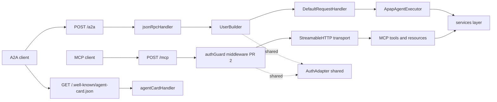
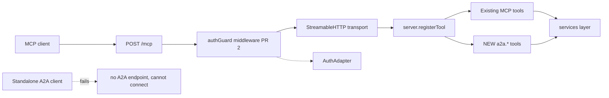
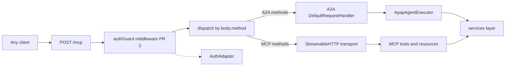

# A2A architecture: sidecar vs true adapter

Detailed analysis of three architecture options for the A2A wrapper: sidecar (A2A on `POST /a2a` alongside MCP), true adapter Reading 1 (A2A skills as MCP tools), and true adapter Reading 2 (multiplex A2A + MCP on `POST /mcp`). Companion to the shorter walkthrough deck at `a2a-design-walkthrough.md`.

---

## TL;DR

- Two shapes on the table: **sidecar** (A2A on its own route) or **true adapter** (A2A inside MCP).
- Analysis leans **sidecar** on 7 of 10 dimensions, 2 of them decisive: A2A wire-spec compliance and discovery card.
- **Unresolved definition question**: "true adapter" has two plausible readings (as MCP tools, or multiplex on `/mcp`). Both diagrammed below.
- **Hidden dimension worth surfacing**: whether MCP clients (e.g. Claude Desktop) must be able to invoke A2A capabilities. If yes, true adapter Reading 1 becomes materially stronger than the tally suggests.

---

## Option A: Sidecar

A2A on `POST /a2a` next to MCP on `POST /mcp`. Same Express app, different routes. Both call a shared `AuthAdapter` utility.


**Flow in plain English**: An A2A client hits `POST /a2a`; the request goes through `jsonRpcHandler` → `UserBuilder` (which calls the shared `AuthAdapter`) → `DefaultRequestHandler` → `ApapAgentExecutor` → services. An MCP client hits `POST /mcp`; the request goes through the auth middleware (same `AuthAdapter`) → transport → registered tools → same services. Two separate endpoints, one shared auth utility, one shared services layer. Discovery card served separately at `/.well-known/agent-card.json` via `agentCardHandler`.

**Pros**
- Works with any standard A2A client out of the box, because the endpoint follows the A2A spec.
- Ships with a discovery document at the well-known URL, so A2A clients can find the server automatically.
- Purely additive to the existing codebase: nothing about the current MCP transport changes, so nothing that already works is at risk.
- Has its own test surface: A2A tests do not need any MCP setup to run.
- Isolates failures: a bug in the A2A code path does not touch MCP, and vice versa.
- Uses the A2A SDK the way its documentation describes, which means future SDK updates flow in without custom rework.
- Sets a pattern for later protocols: adding a third protocol (gRPC or another agent framework) means adding a new peer route, not rewriting existing ones.

**Cons**
- Auth logic lives in two places (once for A2A, once for MCP). Both call the same shared utility, but a future contributor could add a new route and forget to wire it in.
- Slightly more setup at boot: two routes to register instead of one.

<details><summary>Mermaid source (renders on GitHub / Obsidian / VS Code preview)</summary>


</details>

## Option B: True adapter (Reading 1, "expose as MCP tools")

A2A skills registered as MCP tools. No `POST /a2a`, no A2A discovery URL. MCP clients get A2A capabilities via `tools/call`. Standalone A2A clients cannot connect.


**Flow in plain English**: Only `POST /mcp` exists. An MCP client hits `POST /mcp`; the request goes through the auth middleware → transport → `server.registerTool` dispatch. Existing MCP tools live there alongside newly-registered `a2a.*` tools; both call the same services. A standalone A2A client (one that speaks the A2A JSON-RPC wire) has no endpoint to connect to and cannot use this server at all.

**Pros**
- Auth logic lives in exactly one place, so no chance of two routes drifting out of sync.
- Existing MCP clients (like Claude Desktop) can invoke A2A capabilities natively via `tools/call`, with no client-side changes needed.
- Fewer moving parts than sidecar: one endpoint, one dispatch path, one place to reason about the request flow.

**Cons**
- **Does not follow the A2A wire spec.** There is no `POST /a2a` endpoint, so a standalone A2A client cannot connect to this server at all.
- No A2A discovery document either. Clients that rely on the well-known URL to find the server have no way in.
- Bypasses the A2A SDK completely. Any future SDK improvement (bug fixes, new features, security patches) has to be reimplemented here by hand.
- Adds new `a2a.*` tool blocks into `handlers/mcp.ts` and couples A2A tests to MCP test setup.
- Awkward if a third protocol needs to be supported later: each new protocol means more tool blocks stuffed into the same file.
- The workstream is named "A2A wrapper" but ships no A2A endpoint; integrators looking for one will not find it.

<details><summary>Mermaid source</summary>


</details>

## Option B alt: True adapter (Reading 2, "multiplex on /mcp")

Custom method-dispatch middleware inspects `body.method` and routes A2A methods to the A2A SDK, MCP methods to the MCP transport. One endpoint, two wire protocols. No reference implementation in the wild.


**Flow in plain English**: All traffic hits one endpoint (`POST /mcp`), but two different kinds of clients send two different kinds of requests to it. The auth middleware runs first. Then a custom piece of code (the "method-dispatch middleware") reads the `method` field inside the JSON body and decides where to send the request: if the method name belongs to A2A's vocabulary, route to the A2A SDK; if it belongs to MCP's vocabulary, route to the MCP transport. Both paths end up calling the same services layer.

**Pros**
- Auth logic lives in exactly one place, so no duplication across routes.
- Technically compliant with the A2A wire spec, as long as the discovery document points A2A clients to `/mcp`.
- Uses both the A2A SDK and the MCP SDK the way their documentation describes (no bypass).
- Only one URL to publish and operate: A2A and MCP clients share the same endpoint.

**Cons**
- Requires a small piece of custom code (a "method-dispatch middleware") that neither SDK provides. It has to be written from scratch and maintained locally.
- **No one else has built this pattern.** There is no reference implementation of A2A + MCP multiplexed on one endpoint anywhere in the open-source world; this design is being invented here.
- **Worst blast radius of any option**: a bug in the dispatcher takes down both A2A and MCP at the same time.
- The discovery document would tell A2A clients to connect to `/mcp`. Most A2A clients expect a URL that speaks only A2A, so a multiplexed endpoint may be an unexpected shape.
- Rewrites the existing `/mcp` dispatch code, which means touching MCP behavior that already works. Any regression here affects features that already ship.
- A2A and MCP tests become coupled through the shared dispatcher; failures in one can mask or trigger failures in the other.
- Adding a third protocol later means adding more method-name mappings into the same dispatcher. The pattern does not scale gracefully as more protocols are added.
- The MCP SDK's transport handles per-session state on `/mcp`, and this may interact awkwardly with how A2A tracks task lifecycles across requests.

**What "multiplex" means**: running two independent things over one shared channel. Here, one HTTP endpoint carries traffic for two protocols (A2A + MCP) at the same time. Analogy: an apartment building with one street address but many units (one door, many destinations). The "method-dispatch middleware" is the mailroom that looks at the label on each envelope and sends it to the right unit.

**What "A2A methods" vs "MCP methods" means**: both protocols use the same JSON-RPC 2.0 envelope (`{jsonrpc, method, params, id}`), but each protocol has its own vocabulary in the `method` field. That vocabulary is the ONLY signal the server has to know which protocol the client is speaking:

| Protocol | Example method names (the vocabulary) |
|---|---|
| **MCP** (MCP spec) | `initialize`, `tools/list`, `tools/call`, `resources/list`, `resources/read`, `prompts/list` |
| **A2A** (A2A spec) | `message/send`, `message/stream`, `tasks/get`, `tasks/list`, `tasks/cancel` |

Concrete side-by-side of what would hit `POST /mcp` under R2:

```json
// MCP client → routes to MCP transport (because "tools/call" is MCP vocabulary):
{"jsonrpc":"2.0","method":"tools/call","params":{"name":"createTemplate",...},"id":1}

// A2A client → routes to A2A SDK (because "message/send" is A2A vocabulary):
{"jsonrpc":"2.0","method":"message/send","params":{"message":{...}},"id":1}
```

**Sketch of the method-dispatch middleware** (this is the ~6 lines of glue that R2 requires and that neither SDK ships):

```javascript
function methodDispatchMiddleware(req, res, next) {
    const m = req.body.method;
    if (m === 'message/send' || m.startsWith('tasks/'))    return a2aHandler(req, res);
    if (m === 'tools/call' || m === 'resources/read' || m === 'initialize') return mcpTransport(req, res);
    return res.status(400).json({ error: 'unknown method' });
}
```

No reference implementation of this pattern exists in the wild for A2A + MCP together.

<details><summary>Mermaid source</summary>


</details>

---

## Pros/cons at a glance

| # | Dimension | Sidecar | Adapter R1<br>(as MCP tools) | Adapter R2<br>(multiplex on /mcp) | Winner | Why in one line |
|:---|:---|:---|:---|:---|:---|:---|
| 1 | Auth reuse | 1 utility,<br>2 call sites | 1 utility,<br>1 call site | 1 utility,<br>1 call site | R1 & R2<br>(marginal) | One code path is fewer places<br>to drift than two |
| 2 | **A2A wire-spec<br>compliance** | Compliant | **Not compliant** | Compliant if discovery card<br>advertises `/mcp` | **Sidecar<br>(decisive)** | R1 has no A2A endpoint at all;<br>R2 is theoretically compliant<br>but has zero reference<br>implementations in the wild |
| 3 | Deployment /<br>backwards compat | Purely additive<br>routes | New MCP tools appear<br>in `tools/list` | Adds custom dispatcher<br>to `/mcp`, touches MCP's<br>dispatch path | Sidecar | Only sidecar leaves existing<br>MCP behavior untouched |
| 4 | Testability +<br>isolation | Independent<br>test surface | Bloats `mcp.test.ts`<br>or couples to it | Test surface couples A2A<br>and MCP paths through<br>one dispatcher | Sidecar | A2A tests do not have to<br>load MCP setup |
| 5 | Blast radius | A2A bug does<br>not touch MCP | A2A tool crash caught<br>by MCP dispatch | Dispatcher bug takes down<br>both protocols | Sidecar | R2 has the worst blast radius;<br>a bug in the shared dispatcher<br>fails everything |
| 6 | Migration cost +<br>PR sequencing | Zero change to<br>`handlers/mcp.ts` | Adds tool blocks to<br>`handlers/mcp.ts` | Rewrites `/mcp`<br>dispatch code | Sidecar | Sidecar keeps PR 1 out of<br>`handlers/mcp.ts`; R2 rewrites<br>its dispatch |
| 7 | Wire conformance +<br>SDK contract | Uses `@a2a-js/sdk`<br>as designed | Bypasses A2A SDK<br>entirely | Uses both SDKs plus<br>custom glue | Sidecar | Sidecar uses the SDK the way<br>it is designed; R2 invents<br>novel glue with no precedent |
| 8 | **Discovery card** | `agentCardHandler`<br>at well-known URL | **No A2A discovery** | Discovery needed and<br>points to `/mcp` | **Sidecar<br>(decisive)** | R1 has no A2A discovery at all;<br>R2 works but advertises a<br>multiplexed endpoint that no<br>A2A client expects |
| 9 | Enterprise-hook<br>auth (Dan Q2) | Same integrator<br>swap experience | Same, one fewer<br>call site | Same, one fewer<br>call site | R1 & R2<br>(marginal) | One call site is slightly<br>simpler for integrators |
| 10 | Future extensibility<br>(gRPC, other<br>agent frameworks) | Peer routes,<br>natural evolution | Awkward | Adds more method-name<br>mappings to the dispatcher | Sidecar | Peer routes generalize cleanly;<br>R2's dispatcher grows as each<br>new protocol adds method-name<br>mappings |

**Tally**: Sidecar wins 7 (2 decisive). R1 wins 2 marginal (auth reuse, enterprise-hook). R2 wins 2 marginal (same as R1) plus a discovery-card tie. R2 is strictly worse than R1 on 3 dimensions (deployment, blast radius, migration cost) and no better on any dimension.

---

## Recommendation

**Sidecar (Option A).** The two decisive wins on wire compliance and discovery are non-negotiable for a workstream called "A2A wrapper." True adapter's marginal wins on auth-chain simplicity do not outweigh a non-conformant A2A endpoint.

**Failure mode to accept**: sidecar's shared `AuthAdapter` utility can drift if a future contributor adds a route without wiring the middleware. Mitigation: a test asserts both call sites use the same utility.

---

## Red-team on this analysis

| # | Flag | Severity | Action |
|:---|:---|:---|:---|
| R1 | **"True adapter" is ambiguous.** Two readings (as MCP tools vs multiplex on /mcp) give different answers. | Potential BLOCKER | Confirm intended reading with the design-review group |
| R2 | Sidecar's shared-utility auth can fragment if a route skips the middleware. Adapter's single-chain has this structurally prevented. | Moderate | Add a test that asserts both auth call sites route through the same `AuthAdapter` |
| R3 | Discovery-card decisive claim only holds if A2A clients need to discover the server. If the workstream is only MCP-to-APAP-as-agent, discovery is optional. | Moderate | Confirm the workstream's target client set |
| R4 | "Smaller PR" claim for sidecar is about reviewability (new file) not raw diff size. Line counts are comparable. | Weak | Reframe as "isolated file" in the recommendation |
| R5 | Analysis assumes `@a2a-js/sdk@1.0.1` is stable. If the SDK churns, sidecar's SDK exposure is higher. | Weak | Verify SDK stability signal (release cadence, breaking changes so far) |
| R6 | **Missing dimension: can an MCP client (Claude Desktop) invoke A2A capabilities?** If yes, true adapter wins on this hidden dimension. | Moderate | Confirm whether MCP-client-invokes-A2A is a workstream goal |
| R7 | The 10-dimension tally can read as mechanical. The recommendation section should carry the reasoning as prose, not as a raw tally translation. | Meta | Recommendation section stays prose-first; tally cited for support, not copied |

---

## Open questions

1. **"True adapter" interpretation** (R1): Reading 1 (expose as MCP tools), Reading 2 (multiplex on /mcp), or something else entirely?
2. **MCP client invokes A2A** (R6): is this a workstream goal? If yes, sidecar loses a hidden dimension.
3. **Discovery-card requirement** (R3): do target A2A clients rely on `/.well-known/agent-card.json` discovery, or can they be pre-configured with the endpoint?

Answers to these three collapse the remaining ambiguity. If all three land in favor of sidecar's assumptions, the recommendation stands. If any flip, the analysis is redone for the flipped assumption.

---

## Ground truth (verified 2026-08-13 against installed SDKs)

- **A2A SDK** (`@a2a-js/sdk@1.0.1`): `DefaultRequestHandler(agentCard, taskStore, agentExecutor)` + `jsonRpcHandler({ requestHandler, userBuilder })`. Independent of MCP.
- **MCP SDK** (`@modelcontextprotocol/*@2.0.0`): `NodeStreamableHTTPServerTransport` on `POST /mcp` (session-multiplexed). `server.registerTool` + `server.registerResource`. No knowledge of A2A.
- **APAP current state**: `handlers/crud.ts:6, 324, 328-338` has the auth chain commented out. Nothing enforces identity on any route today. `handlers/mcp.ts:629` is the `POST /mcp` route.
- **PR sequencing (Dan 2026-08-11)**: A2A + MCP-auth-uncomment ship in two separate PRs regardless of A2A architecture.
- **Auth model (Dan 2026-08-11)**: enterprise-hook interface as default, Auth0 as one bundled adapter, regardless of A2A architecture.
